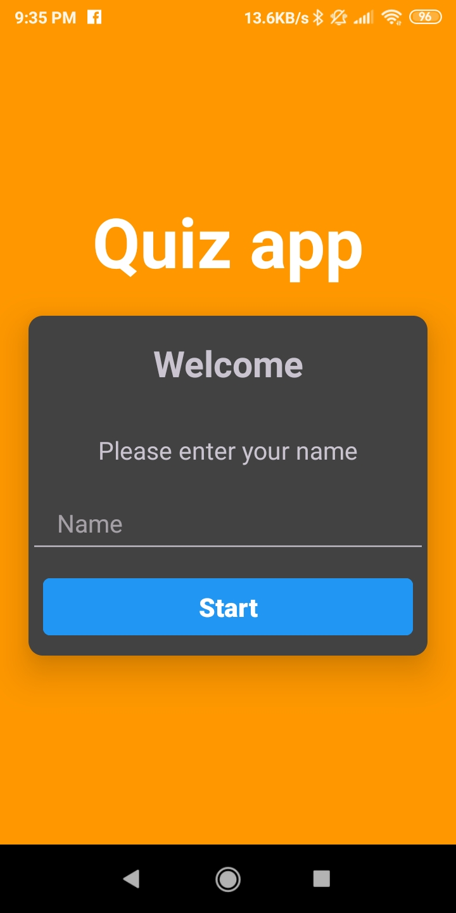
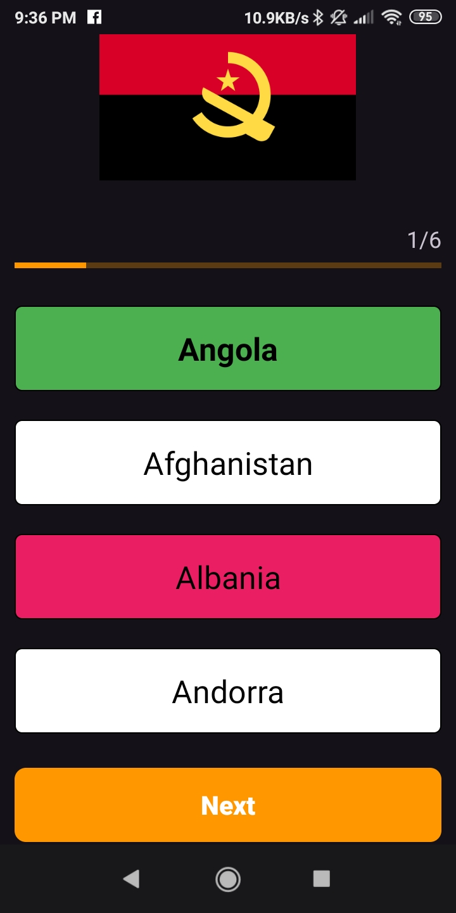
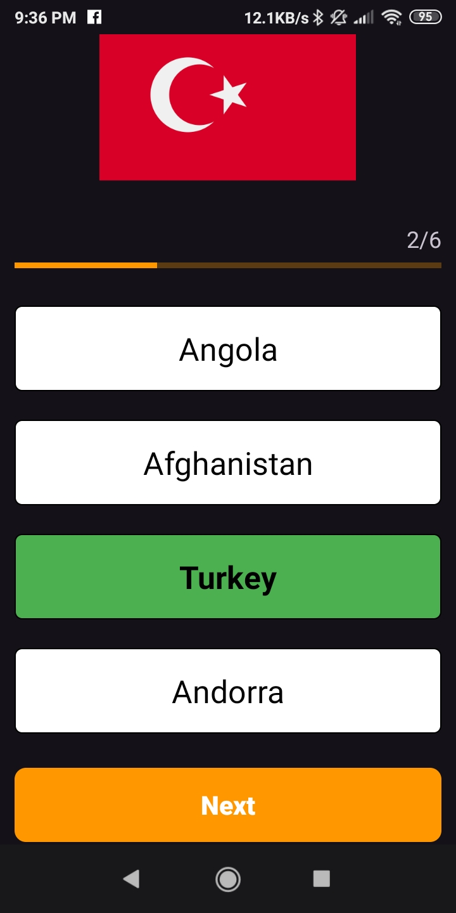
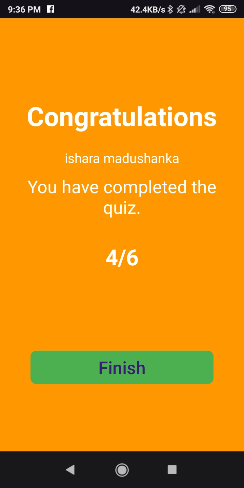
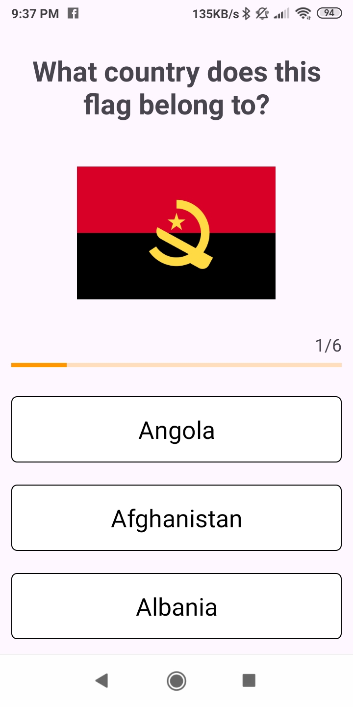
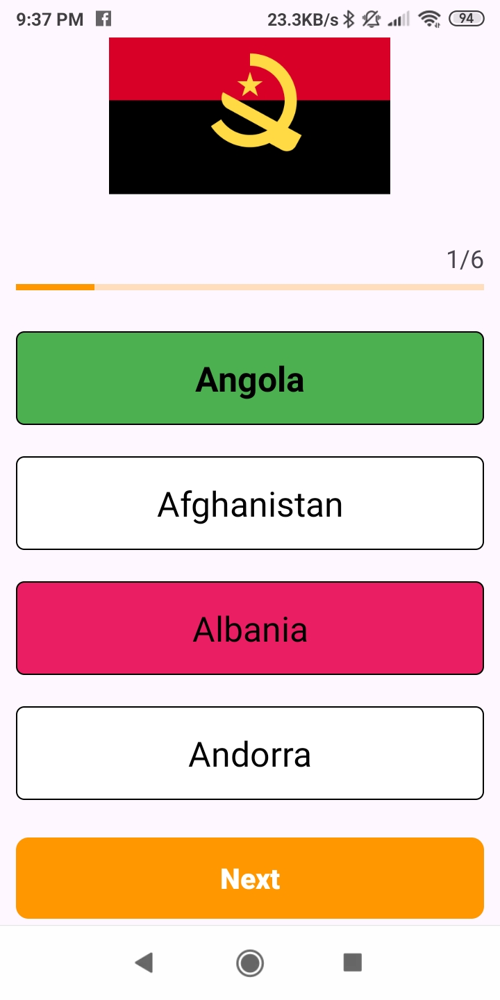
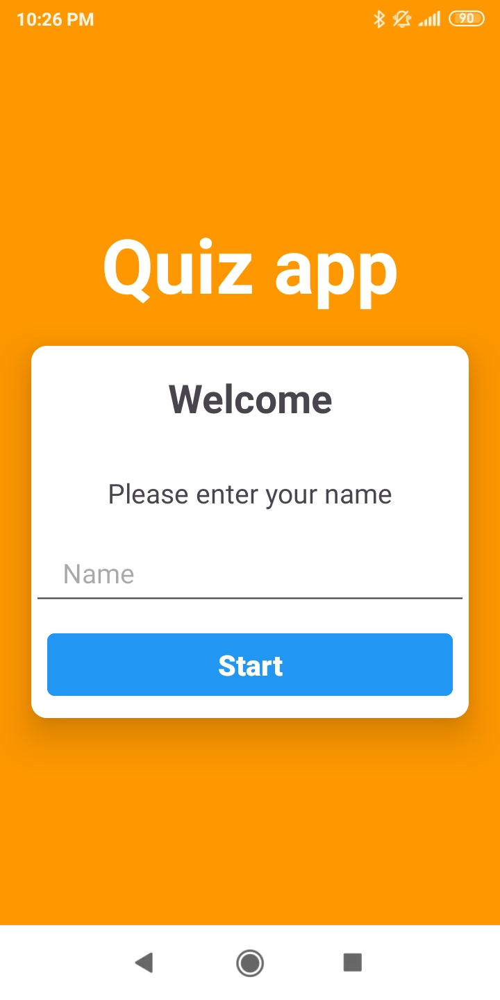

# **Simple Quiz App** 🎓  

Welcome to the **Simple Quiz App**, a fun and interactive way to test your knowledge on various topics! Challenge yourself, track your score, and learn something new every day with this easy-to-use app.  

---

## **Features**  

- **Multiple Choice Questions**  
  Answer a variety of questions with four options to choose from. Select the correct answer and earn points!  

- **Dynamic Scoring**  
  Keep track of your progress with real-time scoring based on your correct answers.  

- **User-Friendly Interface**  
  A clean and minimal design ensures a seamless quiz-taking experience.  

- **Score Summary**  
  At the end of the quiz, view your total score and the number of questions answered correctly.  

- **Restart or Exit Options**  
  Easily restart the quiz or return to the main menu after completing a session.  

---

## **App Screenshots** 📱  

Here’s a sneak peek of the app:  

| Screenshot 1                          | Screenshot 2                          | Screenshot 3                          | Screenshot 4                          |  
|---------------------------------------|---------------------------------------|---------------------------------------|---------------------------------------|  
|  |  |  |  |  

---
| Screenshot 5                          | Screenshot 6                          | Screenshot 7                          | Screenshot 8                          |  
|---------------------------------------|---------------------------------------|---------------------------------------|---------------------------------------|  
|  |  |  |  |  

---

## **How It Works**  

1. Start the quiz by entering your name.  
2. Answer multiple-choice questions within the given time limit (optional).  
3. Get instant feedback on your selection and move to the next question.  
4. View your final score at the end of the quiz.  

---

## **Technical Information**  

- **Platform:** Android  
- **Language:** Kotlin  
- **Requirements:** Android 5.0 (Lollipop) and above  
- **Permissions Required:** None  

---

## **Privacy and Data Usage**  

This app does not collect or store any personal data. Your quiz progress and scores are only visible during the current session and are not saved permanently.  

---

## **Installation**  

To use this app:  

1. Clone or download the repository.  
2. Open the project in Android Studio.  
3. Build and install the app on your Android device.  
4. Launch the app, start the quiz, and enjoy!  

---

## **Future Plans**  

Our roadmap includes:  
- Adding new question categories and difficulty levels.  
- Enhancing the user interface with animations and themes.  
- Introducing a global leaderboard to compare scores with friends.  
- Enabling offline support for quiz data.  

---

## **Contact Us**  

For any issues, feedback, or suggestions, feel free to [open an issue](https://github.com/ishara-madu/Interactive-Quiz-App/issues) or reach out via email at [isharamdushankab@gmail.com].  

---

## **Contributing**  

We welcome contributions! Fork the repository, make your changes, and submit a pull request to help improve the app.  

---

## **License**  

This project is licensed under the MIT License - see the [LICENSE](LICENSE) file for details.  

---

**Get ready to learn and have fun with the Simple Quiz App!** 🚀  
